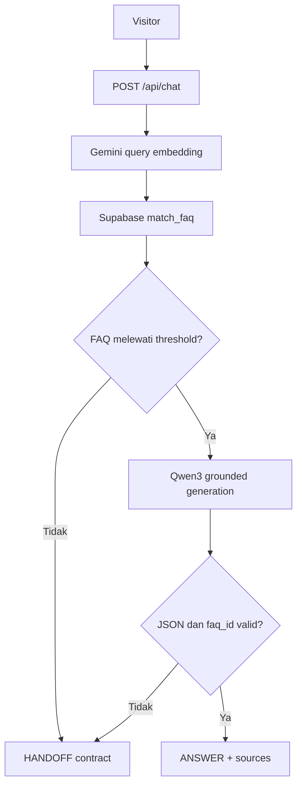

# Campus FAQ Chatbot

Campus FAQ Chatbot adalah layanan informasi kampus berbasis FAQ yang menggabungkan pencarian semantik, jawaban berbasis konteks, dan mekanisme pengalihan ke customer service. Backend hanya mengizinkan model generatif menjawab menggunakan FAQ yang ditemukan di knowledge base; pertanyaan tanpa konteks memadai dikembalikan sebagai keputusan `HANDOFF`.

Demo produksi: [campus-faq-chatbot-nu.vercel.app](https://campus-faq-chatbot-nu.vercel.app)

## Status implementasi

| Komponen | Status | Keterangan |
|---|---|---|
| API Node.js/Express | Selesai | Berjalan lokal dan sebagai Vercel Function |
| Knowledge base Supabase | Selesai | PostgreSQL, pgvector, HNSW, dan RPC `match_faq` |
| Embedding FAQ dan query | Selesai | Gemini `gemini-embedding-001`, 1536 dimensi |
| Jawaban berbasis konteks | Selesai | Qwen3 melalui Cloudflare Workers AI |
| Verifikasi keluaran LLM | Selesai | Validasi format JSON dan `faq_id` hasil retrieval |
| Handoff contract | Selesai | Backend mengembalikan `HANDOFF` dengan aksi `OPEN_WIDGET` |
| Widget tawk.to | Belum dipasang | Embed code/Property ID akan dipasang oleh tim pengelola website |
| FAQ resmi kampus | Perlu disiapkan | Data pada `knowledge/faqs.sample.json` hanya untuk demonstrasi |

Project ini tidak menggunakan AI Assist tawk.to. tawk.to ditempatkan sebagai kanal lanjutan untuk percakapan dengan agen manusia setelah backend memutuskan bahwa jawaban otomatis tidak layak diberikan.

## Arsitektur



Alur pemrosesan terdiri dari dua pemeriksaan:

1. Supabase hanya mengembalikan FAQ berstatus `published` dengan cosine similarity yang mencapai `MATCH_THRESHOLD`.
2. LLM wajib mengembalikan tepat satu object JSON valid. Untuk keputusan `ANSWER`, seluruh `faq_id` harus unik, berformat UUID, dan terdapat pada hasil retrieval; satu ID yang tidak valid atau tidak dikenal menyebabkan `HANDOFF`.

Jika salah satu pemeriksaan gagal, backend mengembalikan `HANDOFF`. Ketika tidak ada FAQ yang relevan, model generatif tidak dipanggil.

## Teknologi

| Lapisan | Implementasi |
|---|---|
| Runtime | Node.js 24 |
| HTTP API | Express 5 |
| Validasi | Zod |
| Vector database | Supabase PostgreSQL + pgvector |
| Embedding | Google Gemini `gemini-embedding-001` |
| Model generatif | `@cf/qwen/qwen3-30b-a3b-fp8` melalui Cloudflare Workers AI |
| Frontend demo | HTML, CSS, dan JavaScript tanpa framework |
| Deployment | Vercel |
| Human handoff | Kontrak integrasi tawk.to |

## Struktur repository

```text
.
├── docs/                         Dokumentasi arsitektur
├── knowledge/                    Sumber FAQ berbentuk JSON
├── public/                       Antarmuka demo
├── scripts/                      Script ingest FAQ
├── src/
│   ├── config/                   Validasi environment
│   ├── middleware/               Admin auth dan error handler
│   ├── prompts/                  Aturan jawaban berbasis FAQ
│   ├── repositories/             Akses data Supabase
│   ├── routes/                   Route chat dan administrasi FAQ
│   ├── services/                 Embedding, retrieval, ingest, dan LLM
│   └── utils/                    Parser dan error internal
├── supabase/migrations/          Skema pgvector dan RPC retrieval
├── test/                         Unit dan integration tests
├── index.js                      Entry point Vercel
└── package.json
```

`src/app.factory.js` membentuk aplikasi Express agar dapat diuji tanpa provider nyata. `src/server.js` menyusun dependency produksi dan hanya membuka port ketika aplikasi tidak berjalan di Vercel.

## Persyaratan

- Node.js 24.x;
- project Supabase dengan akses SQL Editor;
- Gemini API key;
- akun Cloudflare dengan Workers AI aktif;
- kredensial tawk.to hanya diperlukan oleh tim yang memasang widget handoff.

## Konfigurasi environment

Buat file `.env` pada root project. File ini sudah dikecualikan melalui `.gitignore` dan tidak boleh dikirim ke repository.

```env
NODE_ENV=development
PORT=3000
ALLOWED_ORIGINS=http://localhost:3000
CHATBOT_API_URL=http://localhost:3000
ADMIN_INGEST_KEY=GANTI_DENGAN_KUNCI_ACAK_MINIMAL_20_KARAKTER

SUPABASE_URL=https://PROJECT_ID.supabase.co
SUPABASE_SERVICE_ROLE_KEY=SUPABASE_SERVICE_ROLE_KEY

GEMINI_API_KEY=GEMINI_API_KEY
GEMINI_EMBEDDING_MODEL=gemini-embedding-001

CLOUDFLARE_ACCOUNT_ID=CLOUDFLARE_ACCOUNT_ID
CLOUDFLARE_API_TOKEN=CLOUDFLARE_API_TOKEN
CLOUDFLARE_LLM_MODEL=@cf/qwen/qwen3-30b-a3b-fp8

MATCH_THRESHOLD=0.65
MATCH_COUNT=3
MAX_CHAT_HISTORY=6
CS_FALLBACK_MESSAGE=Maaf, informasi tersebut belum tersedia dalam FAQ kampus. Saya akan mengarahkan Anda ke petugas layanan kampus.
```

`CHATBOT_API_URL` hanya digunakan oleh `scripts/ingest-file.js`. Nilai tersebut tidak diperlukan oleh runtime Vercel.

Kunci admin dapat dibuat dengan Node.js:

```bash
node -e "console.log(require('node:crypto').randomBytes(32).toString('hex'))"
```

Gunakan nilai `ADMIN_INGEST_KEY` yang sama pada backend dan script ingest. Jangan gunakan Supabase personal access token sebagai `SUPABASE_SERVICE_ROLE_KEY`.

## Menjalankan secara lokal

1. Instal dependency:

   ```bash
   npm install
   ```

2. Buat dan isi file `.env` berdasarkan daftar konfigurasi di atas.

3. Jalankan migration `supabase/migrations/001_faq_pgvector.sql` satu kali melalui Supabase SQL Editor.

4. Jalankan server:

   ```bash
   npm run dev
   ```

5. Buka `http://localhost:3000` atau periksa endpoint health:

   ```bash
   curl http://localhost:3000/api/health
   ```

Respons health menyertakan model embedding, dimensi embedding, dan model generatif yang aktif.

## Mengelola FAQ

FAQ disimpan pada tabel `public.faq_documents`. Kolom `faq_key` bersifat unik sehingga ingest ulang dengan key yang sama memperbarui record melalui mekanisme upsert.

Format satu FAQ:

```json
{
  "faq_key": "jadwal-perkuliahan",
  "question": "Di mana mahasiswa dapat melihat jadwal perkuliahan?",
  "answer": "Jadwal tersedia pada sistem informasi akademik kampus.",
  "category": "akademik",
  "source": "Panduan Akademik 2026",
  "metadata": {
    "tags": ["jadwal", "kuliah"]
  },
  "status": "published",
  "version": 1
}
```

Nilai `status` yang didukung adalah `draft`, `published`, dan `archived`. Hanya FAQ `published` yang dapat muncul pada hasil retrieval.

Dengan server aktif, ingest file JSON dari terminal lain:

```bash
npm run ingest -- knowledge/faqs.sample.json
```

File `knowledge/faqs.sample.json` saat ini berisi data demonstrasi berstatus `published` dengan `source: "contoh-faq"`. Ganti jawaban, sumber, URL, dan prosedur dengan dokumen resmi kampus sebelum digunakan sebagai layanan publik.

## API

| Method | Endpoint | Fungsi | Otorisasi |
|---|---|---|---|
| `GET` | `/api/health` | Memeriksa status dan konfigurasi model | Publik |
| `POST` | `/api/chat` | Memproses pertanyaan visitor | Publik, maksimal 20 request/menit per client |
| `POST` | `/api/ingest` | Membuat embedding dan melakukan upsert FAQ | Admin key |
| `GET` | `/api/faqs` | Mengambil daftar FAQ | Admin key |
| `POST` | `/api/faqs` | Membuat embedding dan melakukan upsert FAQ | Admin key |
| `DELETE` | `/api/faqs/:id` | Mengubah status FAQ menjadi `archived` | Admin key |

Endpoint admin menerima salah satu header berikut:

```http
Authorization: Bearer ADMIN_INGEST_KEY
```

atau:

```http
x-admin-key: ADMIN_INGEST_KEY
```

Contoh request chat:

```bash
curl http://localhost:3000/api/chat \
  -X POST \
  -H "Content-Type: application/json" \
  -d '{"message":"Di mana saya melihat jadwal kuliah?","history":[]}'
```

Respons yang berhasil diverifikasi:

```json
{
  "decision": "ANSWER",
  "answer": "Jadwal perkuliahan dapat dilihat melalui sistem informasi akademik kampus.",
  "confidence": "high",
  "sources": [
    {
      "faq_id": "uuid",
      "question": "Di mana mahasiswa dapat melihat jadwal perkuliahan?",
      "similarity": 0.78
    }
  ],
  "mode": "GROUNDED_LLM"
}
```

Respons handoff:

```json
{
  "decision": "HANDOFF",
  "answer": "Informasi belum tersedia dalam FAQ kampus.",
  "sources": [],
  "handoff": {
    "provider": "tawk.to",
    "action": "OPEN_WIDGET",
    "reason": "NO_RELEVANT_FAQ"
  }
}
```

Alasan handoff yang dapat dikembalikan oleh service chat:

| Reason | Kondisi |
|---|---|
| `NO_RELEVANT_FAQ` | Tidak ada FAQ yang mencapai threshold |
| `LLM_CONTEXT_INSUFFICIENT` | LLM menilai konteks belum cukup |
| `LLM_RESPONSE_INVALID` | Respons model tidak dapat divalidasi |
| `UNVERIFIED_LLM_CITATION` | Model mengutip `faq_id` di luar hasil retrieval |
| `LLM_SERVICE_UNAVAILABLE` | Provider generatif gagal atau timeout |
| `SERVICE_UNAVAILABLE` | Terjadi kegagalan teknis lain pada pipeline chat |

## Batas integrasi tawk.to

Backend telah menyediakan kontrak berikut ketika percakapan perlu dilanjutkan oleh manusia:

```json
{
  "provider": "tawk.to",
  "action": "OPEN_WIDGET"
}
```

Frontend juga telah menyiapkan pemanggilan:

```js
window.Tawk_API.maximize();
```

Namun, repository ini belum memuat embed code atau Property ID tawk.to. Integrator website perlu memasang snippet widget resmi pada halaman target. Setelah snippet tersedia, tombol **Hubungi customer service** dapat membuka widget melalui fungsi yang sudah ada di `public/app.js`.

## Pengujian

Jalankan seluruh test dengan:

```bash
npm test
```

Suite pengujian memeriksa:

- endpoint health, chat, halaman demo, dan autentikasi admin;
- keputusan `ANSWER` dengan `faq_id` terverifikasi;
- handoff untuk FAQ yang tidak relevan, respons invalid, kutipan palsu, konteks tidak cukup, dan kegagalan provider;
- penggunaan task type `RETRIEVAL_DOCUMENT` dan `RETRIEVAL_QUERY`;
- validasi embedding 1536 dimensi;
- proses ingest dan penyimpanan FAQ.

Provider eksternal dan database diganti dengan mock pada test otomatis. Verifikasi koneksi nyata dilakukan melalui pengujian deployment dan inspeksi respons `/api/chat`.

## Deployment ke Vercel

1. Hubungkan repository GitHub ke Vercel.
2. Pilih preset **Express** dengan root directory `./`.
3. Tambahkan seluruh environment variable runtime. `PORT` dan `CHATBOT_API_URL` tidak perlu ditambahkan ke Vercel.
4. Isi `ALLOWED_ORIGINS` dengan origin produksi tanpa trailing slash, misalnya:

   ```env
   ALLOWED_ORIGINS=https://campus-faq-chatbot-nu.vercel.app
   ```

5. Deploy branch `main`.
6. Verifikasi `/api/health`, satu pertanyaan relevan, dan satu pertanyaan di luar knowledge base.

URL preview Vercel memiliki origin berbeda dari domain produksi dan akan ditolak jika tidak tercantum pada `ALLOWED_ORIGINS`.

## Keamanan dan batasan

- `SUPABASE_SERVICE_ROLE_KEY`, Gemini API key, Cloudflare token, dan admin key hanya boleh tersedia pada backend.
- Row Level Security aktif. Hak tabel dan eksekusi RPC untuk `anon` serta `authenticated` dicabut pada migration.
- Endpoint admin menggunakan perbandingan constant-time terhadap `ADMIN_INGEST_KEY`.
- API menggunakan Helmet, allowlist CORS, validasi Zod, batas request JSON 1 MB, dan rate limit pada endpoint chat.
- Riwayat percakapan tidak disimpan oleh backend; browser hanya mengirim bagian terakhir dari riwayat aktif.
- Riwayat dari client tetap diperlakukan sebagai input tidak tepercaya. Validasi role, panjang, dan format tidak membuktikan bahwa isi atau urutan history autentik.
- Test otomatis tidak mengukur ketersediaan, kuota, latensi, maupun perubahan kebijakan provider eksternal.
- Sistem belum menyediakan dashboard admin, audit log perubahan FAQ, analitik percakapan, atau sinkronisasi transkrip tawk.to.
- Threshold `0.65` telah digunakan pada demonstrasi, tetapi tetap perlu dievaluasi ulang menggunakan variasi pertanyaan dan FAQ resmi kampus.

## Referensi teknis

- [Gemini Embeddings](https://ai.google.dev/gemini-api/docs/embeddings)
- [Supabase pgvector](https://supabase.com/docs/guides/ai/vector-columns)
- [Cloudflare Workers AI](https://developers.cloudflare.com/workers-ai/)
- [Vercel Express](https://vercel.com/docs/frameworks/backend/express)
- [tawk.to JavaScript API](https://developer.tawk.to/jsapi/)

