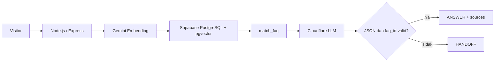

# Campus FAQ Chatbot

Campus FAQ Chatbot menyediakan jawaban kampus berbasis FAQ yang terverifikasi dan
mengalihkan pertanyaan ke layanan manusia ketika konteks tidak cukup. Aplikasi
Production tersedia di [campus-faq-chatbot-nu.vercel.app](https://campus-faq-chatbot-nu.vercel.app).

## Fitur

- pencarian semantik FAQ `published` menggunakan Gemini Embedding dan pgvector;
- jawaban grounded melalui Cloudflare Workers AI dengan validasi JSON dan sumber;
- fallback `HANDOFF` saat retrieval atau hasil model tidak dapat diverifikasi;
- Admin Console di `/admin` dengan Supabase Auth, cookie HttpOnly, CSRF, dan
  allowlist `public.admin_users`;
- pengelolaan FAQ dengan pencarian, filter, pagination, optimistic concurrency,
  dan lifecycle `draft`, `published`, serta `archived`;
- archive/soft-delete sebagai satu-satunya alur penghapusan aplikasi.

## Arsitektur singkat



Pertanyaan dibuat menjadi embedding 1536 dimensi, lalu RPC `match_faq` mencari
FAQ `published`. LLM hanya menerima hasil retrieval. Respons `ANSWER` diterima
jika seluruh `faq_id` berasal dari hasil tersebut; kondisi lain menghasilkan
`HANDOFF`. Penjelasan lengkap ada di [docs/ARCHITECTURE.md](docs/ARCHITECTURE.md).

## Endpoint penting

| Method | Endpoint | Akses | Fungsi |
|---|---|---|---|
| `GET` | `/api/health` | Publik | Status runtime dan model |
| `POST` | `/api/chat` | Publik | Retrieval dan jawaban grounded |
| `GET` | `/api/admin/auth/session` | Session admin | Verifikasi sesi dan role |
| `POST` | `/api/admin/auth/login` | CSRF + exact origin | Login Supabase Auth |
| `POST` | `/api/admin/auth/refresh` | CSRF + exact origin | Rotasi sesi |
| `POST` | `/api/admin/auth/logout` | CSRF + exact origin | Logout dan hapus cookie |
| `GET` | `/api/admin/faqs` | Session admin | List, filter, sort, dan pagination |
| `POST` | `/api/admin/faqs` | Session + CSRF | Membuat FAQ |
| `GET` | `/api/admin/faqs/:id` | Session admin | Detail FAQ |
| `PUT` | `/api/admin/faqs/:id` | Session + CSRF | Memperbarui FAQ |
| `PATCH` | `/api/admin/faqs/:id/status` | Session + CSRF | Mengubah lifecycle FAQ |

Endpoint legacy `/api/faqs` dan `/api/ingest` memakai `ADMIN_INGEST_KEY` dan
dipertahankan untuk proses ingest terkontrol. Detail operasi tersedia di
[docs/OPERATIONS.md](docs/OPERATIONS.md).

## Lifecycle FAQ

- `draft`: dapat ditinjau admin dan tidak ikut retrieval;
- `published`: dapat ditemukan oleh `match_faq`;
- `archived`: disembunyikan dari retrieval dan dapat dipulihkan ke `draft`.

Aplikasi tidak menyediakan hard delete. Penghapusan dilakukan dengan mengubah
status menjadi `archived`, sehingga audit dan pemulihan tetap mungkin. Role
runtime `service_role` tidak mempunyai privilege `DELETE`; hard delete hanya
boleh dilakukan melalui prosedur pemeliharaan khusus dengan backup, otorisasi,
dan verifikasi terpisah.

## Setup lokal

Persyaratan: Node.js 24 dan npm yang membaca `package-lock.json`.

```bash
npm ci
cp .env.example .env
npm run dev
```

Isi `.env` dengan project dan credential lingkungan lokal/non-Production. Jangan
menyalin nilai Vercel atau credential Supabase Production. Aplikasi berjalan pada
`http://localhost:3000` secara default.

```bash
curl http://localhost:3000/api/health
npm test
```

Suite penuh terakhir lulus 298/298 pada Node.js 24 sebelum rilis Production.
Perubahan dokumentasi tidak memerlukan pengulangan suite tersebut.

Setup container lokal dijelaskan di `docs/DOCKER.md` pada branch handoff Docker
lokal. File tersebut sengaja tidak ada pada branch Production karena branch
Docker tidak dipush.

## Migration database

Migration harus dijalankan berurutan melalui Supabase CLI resmi:

1. `001_faq_pgvector.sql` — extension vector, `faq_documents`, HNSW, RLS, dan RPC;
2. `002_admin_auth.sql` — allowlist `admin_users`;
3. `003_faq_documents_service_role_privileges.sql` — reset ACL deterministik;
4. `004_faq_documents_archive_only_privileges.sql` — cabut `DELETE` dari runtime;
5. `005_faq_documents_version_invariant.sql` — version dan `updated_at` via trigger.

Production telah memiliki history `001–005`. Jangan menjalankan ulang migration
atau melakukan repair history tanpa audit katalog, backup tervalidasi, rehearsal,
dan persetujuan perubahan database.

## Deployment dan pemisahan environment

Vercel mendeploy branch `main`. Environment Production harus memakai project
Supabase Production dan exact canonical origin; Preview/staging memakai project
serta nilai terpisah. Jangan menyalin fixture, key, URL database, atau user admin
antar-environment. Runbook deploy, smoke test, dan rollback ada di
[docs/OPERATIONS.md](docs/OPERATIONS.md).

## Dokumentasi

- [Admin Guide](docs/ADMIN_GUIDE.md)
- [Operations Runbook](docs/OPERATIONS.md)
- [Architecture](docs/ARCHITECTURE.md)
- [Admin authentication security](docs/ADMIN_AUTH.md)

## Known limitations

- widget/properti tawk.to belum disertakan; aplikasi hanya menyediakan kontrak
  `OPEN_WIDGET` untuk handoff;
- MFA admin belum diterapkan;
- limiter login memakai memory store per instance serverless, bukan limiter global;
- audit trail perubahan FAQ, bulk import, analytics, dan retrieval tester belum ada;
- kualitas retrieval bergantung pada FAQ resmi dan evaluasi threshold;
- test otomatis memakai mock dan tidak mengukur kuota, latensi, atau perubahan
  kebijakan provider eksternal.
