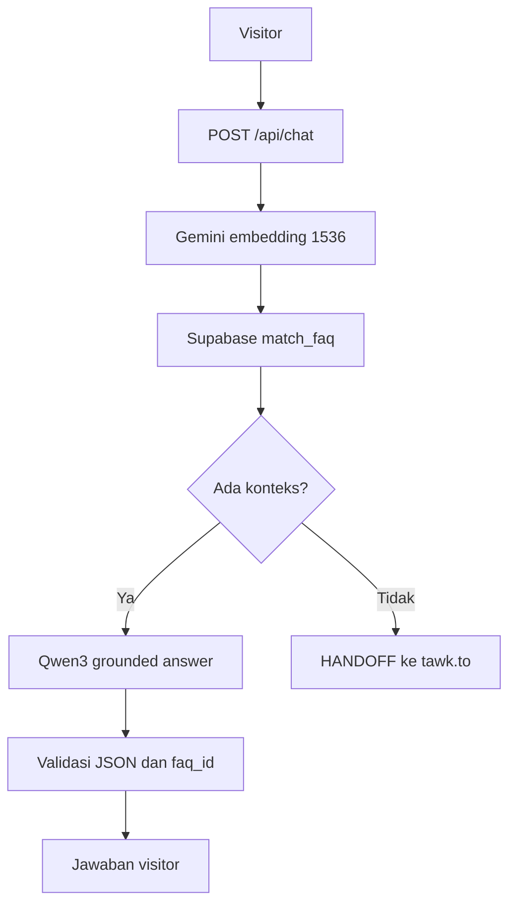

# Arsitektur Campus FAQ Chatbot

## Aliran utama



## Batas komponen

| Komponen | Tanggung jawab | Tidak boleh dilakukan |
|---|---|---|
| Browser/widget | Mengirim pertanyaan dan menampilkan jawaban | Menyimpan API key |
| Node.js API | Validasi, control flow, retrieval, prompt, dan handoff | Menjawab dari pengetahuan yang tidak terverifikasi |
| Gemini API | Membuat embedding FAQ/query 1536 dimensi | Membuat jawaban untuk visitor |
| Cloudflare Workers AI | Menjalankan LLM generatif open-weight | Mengakses Supabase secara langsung |
| Supabase | Menyimpan FAQ/vector dan menghitung similarity | Memanggil LLM |
| tawk.to | Percakapan lanjutan dengan CS manusia | Menjadi provider AI |

## Verifikasi dua langkah

1. `match_faq` hanya mengembalikan FAQ `published` yang mencapai threshold.
2. LLM generatif wajib mengembalikan `faq_ids` yang termasuk dalam hasil retrieval. ID yang tidak dikenal menyebabkan backend mengembalikan `HANDOFF` dengan alasan `UNVERIFIED_LLM_CITATION`.

Gemini menggunakan `RETRIEVAL_DOCUMENT` saat ingestion dan `RETRIEVAL_QUERY` saat pertanyaan visitor diproses. Seluruh FAQ harus dibuat dengan model dan dimensi yang sama.

Jika tidak ada konteks, backend tidak memanggil model generatif. Hal ini mengurangi penggunaan kuota dan mencegah jawaban di luar knowledge base.

## Keputusan integrasi tawk.to

Public webhook tawk.to menyediakan event chat start, chat end, transcript, dan ticket. Tidak ada event publik untuk setiap pesan beserta API terdokumentasi untuk memasukkan balasan bot eksternal ke percakapan native secara real time. Oleh sebab itu:

- chatbot AI menggunakan widget aplikasi;
- keputusan `HANDOFF` menampilkan tombol CS;
- tombol menjalankan `Tawk_API.maximize()` ketika snippet tawk.to kampus tersedia pada halaman;
- percakapan selanjutnya berlangsung di widget tawk.to bersama agen manusia.

## Kontrak respons chat

Jawaban FAQ:

```json
{
  "decision": "ANSWER",
  "answer": "Jawaban yang telah diverifikasi.",
  "confidence": "high",
  "sources": [
    {
      "faq_id": "uuid",
      "question": "Pertanyaan FAQ",
      "similarity": 0.82
    }
  ],
  "mode": "GROUNDED_LLM"
}
```

Handoff:

```json
{
  "decision": "HANDOFF",
  "answer": "Informasi belum tersedia.",
  "sources": [],
  "handoff": {
    "provider": "tawk.to",
    "action": "OPEN_WIDGET",
    "reason": "NO_RELEVANT_FAQ"
  }
}
```
