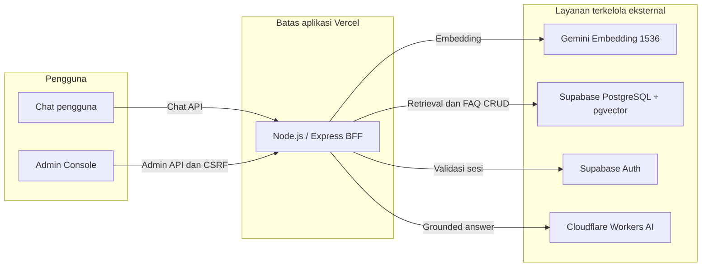

# Arsitektur Campus FAQ Chatbot

## Batas sistem



| Komponen | Tanggung jawab | Batas keamanan |
|---|---|---|
| Browser | Menampilkan chat/Admin Console | Tidak menerima provider key atau token Auth melalui JSON |
| Express | Validasi, orkestrasi, auth BFF, retrieval, dan handoff | Semua secret tetap server-side |
| Gemini | Embedding dokumen dan query 1536 dimensi | Tidak membuat jawaban visitor |
| Supabase | Auth, FAQ/vector, similarity, allowlist admin | RLS aktif; akses runtime dibatasi ACL |
| Cloudflare Workers AI | Generasi jawaban dari konteks | Tidak mengakses database langsung |
| tawk.to | Kanal agen manusia setelah handoff | Snippet/properti belum menjadi bagian repository |

## Pipeline grounded answer

1. Request divalidasi: pesan 2–2000 karakter dan maksimal 12 item history.
2. Gemini membuat embedding query dengan task type `RETRIEVAL_QUERY`.
3. RPC `match_faq` hanya mengembalikan FAQ `published` yang melewati threshold.
4. Tanpa hasil retrieval, backend segera mengembalikan `HANDOFF` dan tidak
   memanggil LLM.
5. Cloudflare LLM menerima konteks hasil retrieval dan wajib menghasilkan satu
   object JSON sesuai kontrak.
6. Backend memastikan setiap `faq_id` unik dan terdapat dalam hasil retrieval.
   JSON invalid, konteks tidak cukup, atau citation asing menghasilkan `HANDOFF`.

Embedding FAQ dibuat dengan task type `RETRIEVAL_DOCUMENT`. Model dan dimensi
harus sama dengan embedding query.

## Data dan lifecycle FAQ

`public.faq_documents` menyimpan konten, metadata, status, version, timestamp,
dan `vector(1536)`. Hanya `published` ikut retrieval. Admin dapat memindahkan:

```text
draft <-> published
  |          |
  +------> archived ----> draft
```

Tidak ada transisi langsung `archived → published`; FAQ dipulihkan ke `draft`
agar dapat ditinjau. Update menggunakan optimistic concurrency dan trigger
database menaikkan version serta `updated_at`.

Runtime `service_role` hanya mendapat `SELECT`, `INSERT`, dan `UPDATE` pada
`faq_documents`. Archive menggunakan update status. Hard delete bukan kemampuan
aplikasi dan hanya boleh dilakukan sebagai pemeliharaan database khusus.

## Autentikasi Admin Console

Browser mengirim email/password ke BFF dengan exact origin dan token CSRF.
Supabase Auth memverifikasi credential. Backend kemudian mencari UUID user pada
`public.admin_users` dan hanya menerima `role=admin` yang aktif. Access/refresh
token disimpan dalam cookie HttpOnly, `Secure` di Production, `SameSite=Strict`,
dan tidak dikembalikan dalam response JSON.

`anon` dan `authenticated` tidak mendapat akses tabel admin atau FAQ. Client
service-role backend hanya dapat membaca allowlist. Rincian ada di
[ADMIN_AUTH.md](ADMIN_AUTH.md).

## Deployment

Entry point Vercel adalah `index.js`; `src/server.js` hanya memanggil `listen`
ketika `VERCEL` tidak ada. Branch `main` adalah sumber deployment Production.
Environment Vercel memisahkan Production dan Preview, sedangkan project Supabase
Production dan staging adalah project berbeda.
